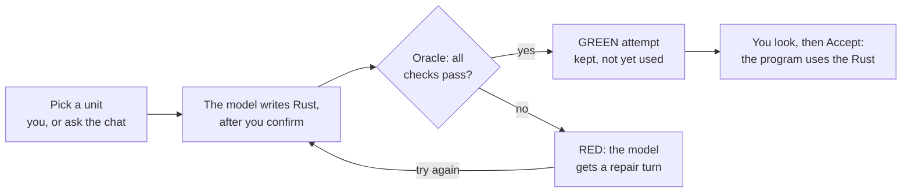
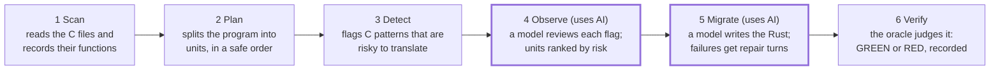

# Getting Started with RuHarness

RuHarness moves a program written in C to Rust one piece at a time: a model writes the Rust, an automatic judge proves it behaves exactly like the C, and nothing becomes final until you accept it. This guide explains how it works in plain terms, then how to use it — through the **cockpit**, a screen with menus and a built-in AI chat, or through typed commands.

## The big idea

RuHarness moves a program written in C to Rust one small piece at a time, and proves each piece behaves exactly like the original before it counts. You never have to read or trust the new code yourself: an automatic judge decides.

The program is split into **units** — one C file, or a small group of files that belong together. The rest of the program stays in C while one unit moves. The new Rust unit keeps the same function names as the C it replaces, so it drops straight into the program.

Three parts do the work:

- **The harness** is the tool that reads the C, works out a safe order for the units, asks an AI model to write the Rust, and keeps records. It never decides whether a translation is right.
- **The oracle** is the judge. It runs the old C and the new Rust side by side on hundreds of the same inputs and demands identical output, runs the whole program both ways, and checks the Rust does nothing it should not. Every check passes → **GREEN**. Anything else → **RED**.
- **The ledger** is a folder of plain text files inside the project. Every scan, plan, attempt and verdict is written there, so the work can be picked up by anyone at any time.



A RED verdict sends the Rust back to the model for repair (still RED after 3 repairs: modify, retry or hand edit); a GREEN one waits for you — until you accept it, the program keeps running the C.

The **cockpit** is the screen that puts all of this in front of you: the program's files and units on the left, the selected item's details on the right, and a chat where you can ask an AI assistant to do the model work. Nothing the model writes becomes part of the program until the oracle says GREEN **and** you accept it.

## How a migration works



A project goes through six steps, and only two of them involve an AI model. The others are ordinary code that gives the same answer every time, so the facts the AI works from, and the judge that checks it, cannot be talked into anything.

1. **Scan** reads every C file and writes down what it contains: each function, and which file uses which.
2. **Plan** splits the program into units and orders them so each unit moves after the units it depends on.
3. **Detect** flags C patterns that are known to be tricky to translate — macros, pointers to functions, data shared across the whole program — so they are not missed.
4. **Observe** asks a model to review each flag, keeping the real ones, and ranks the units by risk. A flag the model dismisses still counts until a person agrees.
5. **Migrate** asks a model to write the Rust for one unit, has the oracle check it, and gives the model up to three turns to repair what failed. Every attempt is kept.
6. **Verify** runs the oracle on the unit and records the verdict. You can run it again at any time; if the code has changed since, the unit shows as out of date.

In the cockpit, steps 1–3 are the project's menu items (Scan the project, Refresh the plan, Find hazards), and step 5 is what the chat asks for. After a GREEN verdict, accepting the result is yours.

## How the judge decides

The oracle runs a fixed list of checks, in order, and the unit is GREEN only if every one passes. None of them relies on anyone's opinion — not yours, not the model's. The names below are the ones the cockpit shows.

| Check | What it asks, in plain words |
| --- | --- |
| Same exports | Does the Rust offer exactly the functions the C unit did, and nothing extra? (So it cannot, for example, replace the system's printing function to fake its results.) |
| Allowed calls only | Does the Rust use no more of the computer than the C did — no files, network, other programs or clocks unless the C used them too? |
| Driver shape | Is the test program (the "driver") only calling the unit and harmless standard functions? |
| The Rust builds | Does the new code compile? |
| Same outputs as C | The test program calls every function hundreds of times with the same inputs, once linked with the C and once with the Rust. Does every output — normal and error messages — match byte for byte? |
| Whole program | The whole real program is built twice, all-C and C-with-the-Rust-piece, and run on sample files. Are the results identical? |
| Sanitizers | Run under memory-checking tools, does the C side show any reads or writes past the end of its memory? |
| Boundary calls | For some units: called with memory sized exactly as the C needs, does the Rust avoid touching anything the C would not? |

**Where the test program comes from.** Each unit has a *driver*: a small C program that calls every function the unit offers with fixed inputs and prints everything. It can be written by a person or by a model (`gen-driver`), and before it is used it is tested against the original C: it must give the same results three runs in a row, the same with and without compiler optimisation, and it must notice deliberate bugs planted in copies of the C. A driver that cannot tell broken C from the real thing is rejected, because it could not catch a broken translation either.

**What the verdict remembers.** A verdict records a fingerprint of exactly the code it tested. If anything changes afterwards — the C or the Rust — the unit shows as needing a re-check instead of quietly staying GREEN.

## Where the AI comes from

RuHarness does not include an AI model of its own. It asks one — whichever you choose — and judges every answer the same way, so models are interchangeable. The way it reaches a model is called a **provider**.

| Provider | How it works | Good for |
| --- | --- | --- |
| The chat (in the cockpit) | Your own Claude Code, signed in with your account, answers the questions a migration asks. | Most people: nothing to set up beyond signing in to Claude Code. |
| Hand-off (`external`, the default) | The harness writes its question to a file and pauses; an AI assistant — or a person — writes the answer file, and the run continues. The chat does this for you automatically. | Using any AI assistant, with no API key. |
| A local model | A model running on your own computer (for example through Ollama). | Free and private; small models usually fail, and the oracle catches it. |
| A cloud model | A service such as Anthropic's or an OpenAI-compatible one, with your API key. | Unattended runs. Your key lives in your own settings file, never in the project, so a project cannot send it anywhere. |
| Replay | Re-checks a recorded attempt from its saved answers, calling no model at all. | Proving a past result still holds, at zero cost. |

Whichever you use, the model only ever writes two files for a unit — the translated logic and the thin layer that connects it to the C — and everything it writes is built and run inside a sandbox before the oracle judges it.

## Words you will see

| Word | What it means |
| --- | --- |
| Target | The project being migrated — the folder you open the cockpit on. |
| Unit | One piece of the program that moves to Rust as a whole: a C file or a few files that belong together. |
| Plan | The list of units in the order they can safely move (a unit goes after the units it depends on). |
| Attempt | One try at translating a unit. A unit can have many attempts; each is kept. |
| Turn | One round inside an attempt: the model writes, the oracle checks, and if something failed the model gets another turn to repair it (3 repairs by default). |
| Oracle | The automatic judge that compares the new Rust with the original C. |
| Checks | The oracle's individual tests (for example "same outputs as C"). A verdict lists each one as passed or failed. |
| GREEN / RED | The oracle's verdict: every check passed / at least one failed. |
| Hand-off | A point where the harness pauses and waits for an answer from a model — in the cockpit, the chat supplies it. |
| Accept | Your decision to make a GREEN attempt the unit's official Rust ("promote" it). In the cockpit nothing is ever accepted automatically. |
| Modify with a note | Ask for a new attempt based on an earlier one, with your written guidance ("steer" in the records). |
| Retry | Ask the model for the same translation again, as a new attempt; the earlier one is kept. |
| Hand edit | Change the Rust yourself in an editor; the oracle still judges it. |
| Ledger | The folder of plain text records inside the target (`migration/`). |
| Scan | Read the C files and record what is in them (functions, which file uses which). |
| Verdict | The oracle's recorded judgement of one unit: every check and its result, plus a fingerprint of exactly the code it tested. |
| Driver | The small test program the oracle uses: it calls every function of a unit with fixed inputs and prints the results, so the C and the Rust can be compared. |
| Hazard | A pattern in the C that is risky to translate (for example a macro or shared global data), flagged so it gets extra care. |
| Provider | The way the harness reaches an AI model: the chat, a hand-off, a local model, or a cloud service. |
| Sandbox | A locked-down space where model-written code is built and run: no network, no access to your personal files, and a time limit. |
| Benchmark | A fixed set of public C programs used to measure how well RuHarness migrates, scored on tests it never saw. |
| Workload | One run of the whole program, with your options and input, that Speed times on the C and on the Rust. |
| As it stands | The program with every verified unit's Rust in place at once — what you would ship today. |

## Before you start

You need a terminal window, the RuHarness tools built on your computer, and — for the chat — Claude Code installed and signed in. If someone set RuHarness up for you, they only need to give you the command in step 3.

1. **A terminal.** On a Mac, open the Terminal app. Make the window wide: at 156 characters or more the chat gets its own column; narrower, it shares the right side of the screen.
2. **The tools**, built once from the RuHarness folder (this needs Rust and a C compiler; on a Mac, `xcode-select --install` provides the compiler):

   ```bash
   cargo build --workspace
   ```
3. **Open the cockpit** on a project (the target folder), from the RuHarness folder:

   ```bash
   cargo run -p harness-tui -- --target targets/zopfli
   ```

   To practise without touching the real project, open a copy of the folder instead — everything the cockpit does is written inside the folder you point it at.
4. **For the chat:** Claude Code (`claude`) installed and signed in. The chat uses your own sign-in (your subscription or your API key) and says which before your first message. Add `--chat-model haiku` to the command in step 3 to use a smaller, cheaper model.

To leave, press `q` (outside the chat) or `Ctrl-C` in the chat. The cockpit asks first if a command is running or a conversation exists; the conversation is not saved.

## Two ways to use RuHarness

Start with the cockpit. It does everything most people need, from menus, and shows the exact command behind every action. The command line is the same tool without the screen.

| | The cockpit (`harness-tui`) | The command line (`harness`) |
| --- | --- | --- |
| What it is | A screen with panes, menus and a chat | Typed commands, one per task |
| Best for | Exploring a project, migrating units, reviewing and accepting results | Scripts, automated checks, and people at home in a terminal |
| How you act | Select an item, press `Enter`, choose, confirm | Type a command such as `harness verify u001-katajainen --target targets/zopfli` |
| The AI | Through the built-in chat | Through a provider you name (`--provider`) |
| Under the hood | Runs the command-line tool for every action | — |

Both read and write the same records (the ledger), so you can mix them: anything done on the command line shows up in the cockpit after `g` (re-read). If two commands try to change the same project at once, the second is refused with the name of the one holding it.

A third, optional way — an AI assistant working in its own window — is in "Other ways to get model work done" below.

## Using the command line

This five-minute tour needs no AI and no API key. Run each command from the RuHarness folder.

1. **Install the `harness` command** (once):

   ```bash
   cargo install --path crates/harness-cli
   ```
2. **See where the migration stands** — what is verified, what is pending, whether anything is out of date:

   ```bash
   harness state status --target targets/zopfli
   ```
3. **Run the judge on the unit that is already migrated.** Expect eight `PASS` lines and `GREEN`:

   ```bash
   harness verify u001-katajainen --target targets/zopfli
   ```
4. **Watch it catch a bug.** Open `targets/zopfli/migration/units/u001-katajainen/katajainen_rs/src/lib.rs`, find `bitlengths[leaves[0].count as usize] = 1;` and change the `1` to `2`. Run step 3 again: "same outputs as C" now fails, the verdict is `RED`, and the unit loses its verified status. Undo everything with:

   ```bash
   git checkout targets/zopfli
   ```
5. **See the plan and the risk report:**

   ```bash
   harness plan --target targets/zopfli
   ```

   then open `targets/zopfli/migration/observer/observations.md` — the units ranked by how risky they are to translate.

**Every command, in plain words.** Each one takes `--target <folder>`: the project to work on.

| Command | What it does |
| --- | --- |
| `harness scan` | Reads the C files and records what is in them: functions, and which file uses which. |
| `harness plan` | Groups the files into units and works out a safe order to move them in. |
| `harness detect` | Flags C patterns that are risky to translate (macros, function pointers, shared global data, …). |
| `harness observe` | Asks a model to review each flag and says which are real; writes the risk report. |
| `harness gen-driver <unit>` | Asks a model for the unit's test program and checks it against the original C before it may be used. |
| `harness migrate <unit>` | Asks a model for the Rust, runs the oracle, gives the model up to three repair turns, and records the attempt; a GREEN one is accepted unless you add `--no-promote`. |
| `harness verify <unit>` | Runs the oracle on the unit's current Rust and records the verdict. |
| `harness promote <unit> <attempt>` | Accepts a GREEN attempt: it becomes the unit's Rust. |
| `harness override <unit> <folder>` | Records your own edit of the Rust as a human attempt, judged like any other. |
| `harness state status` | Checks every record against the files: what is stale, what contradicts what. |
| `harness sync-runtime` | Refreshes the summary an AI assistant reads first (the project's `AGENTS.md`). |
| `harness bench …` | The benchmark (see "How we know it works"). |

**Common options for `migrate`:** `--provider <name>` and `--model <name>` choose the AI (the default is the hand-off); `--retry` records a new attempt even when one is already finished; `--no-promote` keeps a GREEN attempt waiting for `promote`; `--steer "<note>" --from <attempt>` starts a new attempt from an earlier one, guided by your note.

**What the finish means.** Every command ends with a number that scripts can read: `0` success or GREEN · `1` the harness refused or hit an error (the message says why) · `2` the command was typed wrong · `10` the oracle said RED.

## Using the cockpit: a tour of the screen

```
┌ Files ────────────────┐┌ View ───────────────────────────┐┌ Chat ─────────────────────────┐
│ The project's C files ││ What you selected, in detail:   ││ Ask for model work in plain   │
│ and its units, each   ││ a file's C beside its Rust,     ││ words; it asks the cockpit,   │
│ with a state symbol   ││ a unit's checks, an attempt's   ││ never runs anything itself    │
│                       ││ turns, the project's next step  ││                               │
│ Enter: what you can   ││                                 ││ Asks: Migrate u001-…          │
│ do with the selection ││                                 ││ [Review Enter] [Decline Esc]  │
│                       ││                                 ││                               │
│                       ││                                 ││ › your message                │
└───────────────────────┘└─────────────────────────────────┘└───────────────────────────────┘
 Activity line: what the running command is doing   [Cancel x] [Details c]
 Key bar: the keys that work right now — click one to press it
```

You work left to right: pick something in **Files**, read about it in the **View**, and ask the **Chat** for model work. The pane you are in has a highlighted border; `Tab` moves to the next one. Narrower than 156 columns, the chat shares the right side: a `View │ Chat` tab on its border switches.

- **Files** lists the project's C files (open a file to see its functions) and, below them, its **Units** with each unit's Rust and attempts. The symbol beside each row is its state.
- **View** shows the selection in detail: the project's summary and next step, a file's C beside its Rust, a unit's checks in words, or an attempt's turns.
- **Chat** is where you talk to the assistant. Its requests appear on a yellow line above the input with **[Review]** and **[Decline]** buttons.
- The **activity line** narrates the running command in plain words ("Turn 1: asking the model…", "Checked: same outputs as C — passed") and offers **[Cancel]** and **[Details]**.
- The **key bar** at the very bottom lists the keys that work right now; each is also a button you can click.

## Moving around

Everything works with the arrow keys and `Enter`, or with the mouse; there is nothing to memorise. The bottom row of the screen always lists the keys that work right now, and `?` opens the full help.

| Key | What it does |
| --- | --- |
| `↑` `↓` | Move up and down in the pane you are in (in the View: scroll) |
| `←` `→` | In Files: fold or open a row; `→` on the last level moves into the View, `←` comes back |
| `Enter` | Open the menu of what you can do with the selected row |
| `Esc` | Close a menu, dialog or overlay; from the View, go back to Files |
| `Tab` | Go to the next pane: Files → View → Chat |
| `?` | Help: every key, what each symbol means, the chat's keys |
| `c` | Details of the running command: the exact command and everything it reported |
| `x` | Cancel the running command (asked first) |
| `g` | Re-read the project, after a change made outside the cockpit |
| `t` | Try again, after a refusal |
| `q` | Quit (asked first while a command runs) |
| `a m e r R v d` | Shortcuts for menu items of the selected row: Accept, Modify, Hand edit, Retry, Resume, Show the checks, Compare |

**With the mouse:** a click selects a row and its pane; a click on `▸` or `▾` opens or folds it; a double click is `Enter`; the wheel scrolls; a click on a key in the bottom row presses it. To select text on screen, hold `Shift` while you drag (`Option` in iTerm2). If clicks print odd characters, start the cockpit with `--no-mouse`, or turn the mouse off with `m` in the help screen.

Inside the chat, letters are text you type — the chat's own keys are in "The chat" below.

## Doing things: the Enter menu

Select a row and press `Enter` (or double-click it): a short menu lists what you can do with that item right now. An item that cannot run yet is greyed, and choosing it tells you why (for example "a command is running (one at a time)").

| Menu item | Where | What it does |
| --- | --- | --- |
| Scan the project | The project (top row) | Reads the C files and records what is in them. Do this first on a new project, and again after the C changes. |
| Refresh the plan | The project | Works out the units and the safe order to move them in. |
| Find hazards (run the detectors) | The project | Flags C patterns that are risky to translate, so they get extra care. |
| Migrate — ask in chat | A unit not yet migrated, or the project | Puts a request in the chat for a translation of the unit. You still confirm it. |
| Ask in chat… | Anywhere | Moves you to the chat to ask about the selected item. |
| Re-check with the oracle | A unit | Runs the judge again on the unit's current Rust. |
| Show the checks | A unit or attempt with a verdict | Lists every check in words, passed or failed, with what it compared. |
| Accept … into … | A GREEN attempt not yet accepted | Makes that attempt the unit's official Rust. Only you can do this. |
| Compare with the promoted attempt | An attempt | Shows what differs from the Rust already accepted. |
| Modify with a note | An attempt | Starts a new attempt from this one, guided by a note you write ("handle the empty-input case like the C does"). |
| Retry | An attempt | Asks the model for the same translation again, as a new attempt. |
| Resume | A paused attempt | Continues an attempt that was waiting for an answer. |
| Hand edit | A unit's Rust | Opens the Rust in your editor; the oracle judges your edit, and it is recorded as a human attempt. It is never accepted automatically. |
| Cancel the running command | While something runs | Stops it, after asking. |
| Re-read the project | Anywhere | Loads the ledger again (same as `g`). |

Every item that changes something opens a confirmation dialog first — next section. Each unit's state is shown by a symbol beside it:

| Symbol | Meaning |
| --- | --- |
| `✓` | Migrated: its Rust is accepted and GREEN |
| `✓?` | Verified, but no recorded attempt is known to have produced it |
| `✗` | Failing: the latest verdict is RED |
| `⚠` | Needs attention: a cause you can fix, named in the View |
| `◐` | Tried: attempts exist, none accepted yet |
| `◇` | Planned: no attempt yet |
| `⊘` | Blocked |
| `!` | Changed since the last scan |
| `+` | Not scanned yet |
| `?` | Missing: the scan recorded it, the folder no longer has it |

## Confirming an action

Nothing runs until you confirm it in a dialog, and the dialog is built so you cannot confirm by accident. It shows, in words, what the action will write and change, then the exact command it will run.

1. **Read it.** The dialog starts on the safe button (`Cancel`). If it is longer than the window, scroll to the end with `↓` or the wheel — it will not unlock until you have seen all of it ("↓ more below — scroll to the end").
2. **Wait for "ready".** After it has been on screen, whole, for a moment with no keys pending, the status line turns green: "ready: → then Enter". Keys typed or pasted before that point, and a held-down `Enter`, never confirm anything.
3. **Confirm or cancel.** Press `→` to move to the action's button (`Run`), then `Enter`. Or press `Esc` to cancel. With the mouse, the buttons answer a click a second after the dialog opened, and the action button only once it says ready.

If you click too early the dialog says "Too soon — click again". While a command runs, `c` shows its details and `x` offers to cancel it ("Keep running" or "Stop it"). Only one command runs at a time.

## The chat

The chat is an AI assistant (your own Claude Code) that can look up the project's state — its units, verdicts, attempts and pending questions — and ask the cockpit to do model work for you — but it never runs anything itself. Every request it makes waits for you to review and confirm it.

**Getting there.** Press `Tab` until the chat is highlighted, or click **Chat**. On a wide window the chat has its own column; otherwise it takes the right side while you are in it, and a `View │ Chat` tab on the right pane's border brings it back. "Chat ●" means it has something for you. You can also choose **Migrate — ask in chat** or **Ask in chat…** from a row's menu.

**Talking to it.** Type in plain words and press `Enter`: "Please migrate u001-katajainen", "Why is this unit red?", "What does this function do?". It knows what you have selected. The pane's title shows what it is doing: *starting…*, *thinking…*, *ready*, *waiting for you*, *running a command for the chat*, *continuing…*, *stopped*, *ended*.

**What it can ask for, and what stays yours.**

| The chat can ask to… | Only you can… |
| --- | --- |
| Migrate a unit (a new translation) | Scan the project |
| Modify an attempt with a note | Refresh the plan |
| Retry an attempt | Re-check with the oracle |
| Answer the model's questions during a migration (Continue) | Accept an attempt |

For anything in the right column the chat tells you which menu item to use.

**When it asks.** A yellow line appears above the input — "Asks: Migrate u001-katajainen …" — with buttons. It ignores keys for its first second so a keystroke meant for something else never answers it. Then:

- `Enter` (with an empty input) or **[Review Enter]** opens the usual confirmation dialog, with the exact command and a line saying the chat asked for it.
- `Esc` or **[Decline Esc]** says no; the chat is told.
- **[Decline with my draft]** says no and sends what you typed as the reason ("use the other unit first").

**Letting it continue on its own.** A migration is a conversation with the model: it writes Rust, the oracle checks it, and the model gets turns to repair what failed. When you confirm a migration the chat asked for, the dialog tells you the chat will answer these turns itself ("up to 4"). Each answer then continues the run after a quiet second, with a line "Continues … — waits for a quiet moment; Esc holds it". This permission ends as soon as you hold one (`Esc`), decline or cancel one, stop the chat or start a new one — after that every answer asks you first. It is never given when the cockpit runs without its sandbox. It never accepts anything: Accept is always yours.

**The chat's keys** (letters are text here):

| Key | What it does |
| --- | --- |
| `Enter` | Send your message (or review a waiting request, when the input is empty) |
| `Ctrl-J`, `Alt-Enter`, or `\` then `Enter` | New line in your message |
| `Esc` | Decline a request, hold a waiting Continue, or stop the reply |
| `Ctrl-C` | Stop the reply; press again to clear your draft; then quit (asked) |
| `Ctrl-X` | Cancel the running command (asked) |
| `Ctrl-N` | Start a new chat (asked); the new one does not see the old conversation |
| `↑` `↓` `PgUp` `PgDn` | Scroll the conversation |
| `Tab` | Leave the chat |
| `F1` | Help |

If you leave the chat with an unsent draft, letters in the other panes are ignored until you press an arrow, `Tab` or `Esc` — so typing that was meant for the chat never triggers a shortcut. Everything the chat asked for is recorded as "asked in chat".

## Your features: what a person does with the program

The judge compares each translated piece with the C one on its own. But what a person notices
is the whole program: "compress this file to gzip", "show the help", "say the file is
missing". Your **features** are those things, in your own words — and RuHarness checks them too.

A feature is made of one or more **scenarios**: one run of the whole program with fixed
arguments and, if you like, one of three sample files as its input (a page of English text,
some random bytes, or an empty file). The program runs in an empty folder of its own, so an
argument is a flag or a word, never a path.

- **Write them.** On the Features row in the tree, press Enter and choose *Write your features
  file*. The cockpit tells you which editor opens and how to save and leave it (in nano:
  Ctrl-O then Enter saves, Ctrl-X leaves). When you come back it checks the file and asks
  before saving it.
- **Every Re-check runs them.** From then on, every Re-check (and every translation the chat
  asks for) runs each scenario on the C program and on the program with that piece's Rust
  swapped in, and compares what a person would see: the exit status and everything printed.
  A scenario the C itself cannot run the same way twice is skipped and named — it never stops
  you from working.
- **Map them.** *Map the features* runs each scenario on a scratch copy of the C in which every
  function notes that it ran. The Features view then shows, for each feature, which pieces of
  the program it runs, which of those are already in Rust, and whether its checks passed there
  — and each piece says how many of your features run it, and names any that failed on it. A
  piece that none of your features runs is said plainly: its checks pass whatever its Rust
  does, so you may want a scenario that reaches it. A few functions cannot carry a note (the
  compiler refuses one where it stands, or the parser cannot read the function): they are left
  unwatched, never counted as "not run", and the cockpit shows the reason beside each.

Each piece is still checked with only its own Rust swapped in: a feature's own view says so
when it "holds so far". Commit `migration/features/` with your work.

## Speed: is the Rust as fast as the C?

The judge checks that the Rust does the same thing as the C. **Speed** tells you whether it does
it as fast. It is never part of a verdict: a slower unit is still a correct one — you decide
whether the difference matters.

You describe a few **workloads**: runs of the whole program the way it is really used, each with
your own options and, if you like, one input file of yours inside the project (a real file, at
most 64 MiB, committed with the project). perf runs each workload as the original C, then with
each verified unit's Rust swapped in on its own, then with every verified unit together ("the
program as it stands"). The C and the Rust take turns, many times each (15 by default), on the
same computer, and perf says which was faster and by how much — or honestly that it cannot tell.

- **Write them.** On the Speed row in the tree, press Enter and choose *Write your workloads
  file*. It works like the features file: your editor opens a private copy, the cockpit checks
  it when you come back, and asks before saving it. A run should take the C half a second of CPU
  or more; one under half a second that also runs fewer than a billion instructions reads "too
  short to time".
- **Measure.** Choose *Measure speed* (or, on a verified unit, *Measure this unit's speed*). The
  dialog says how many runs it will make and about how long it takes, and what it writes. Keep
  the computer quiet while it measures: other work makes the numbers noisier. Cancel keeps the
  rows already finished.
- **Read the results.** The Speed view lists the C, the program as it stands and each unit,
  worst first: "about as fast", "slower 6.2 % (4.1–8.3 %)" — the best guess and the range it
  surely lies in — "probably slower", "close call", "can't tell" (measure again with 31 runs on a
  quiet computer), "too short to time". Move to a row to read its full sentence. A row turns
  "out of date" when the C, the Rust or the workload changed since; measure again.
- **Behaves differently.** perf also compares what the program prints and how it ends. If the
  Rust prints or ends differently on one of your workloads, that row says so in red on the unit,
  and *Compare the outputs* shows both around the first difference. The judge's checks do not
  run your workloads, so this is something only perf can find.
- **If a unit is slower and speed matters,** the unit's view says what to do, by how its Rust was
  made: Modify the model's attempt with a note about speed and Replace (and back, if it is not
  faster), Hand edit it, or — for Rust written outside the cockpit — commit it, edit it and
  verify it in a terminal. Note the numbers first, or commit `migration/perf/`: measuring again
  replaces a row.

Numbers are of one computer at one time; commit `migration/perf/` with your work to keep a
history. Speed runs on macOS for now.

## Your first migration, step by step

This walk-through migrates one unit through the chat, from asking to accepting. It takes a few minutes, most of it waiting for the model and the oracle. The example uses a practice copy of the zopfli project in which the unit `u001-katajainen` has been reset to planned (in the project itself it is already migrated). In your own project, any unit marked `◇` (planned) or `✗` (failing) works the same way.

1. **Open the cockpit** on the project (see "Before you start"). The Files pane lists the C files and, below them, the Units.
2. **Find the unit.** Move down to it with `↓` and look at the View on the right: its state, its C files and what it depends on.
3. **Go to the chat.** Press `Tab` until the chat is highlighted. The first time, it says "starting Claude Code (signed in with …)".
4. **Ask.** Type `Please migrate u001-katajainen.` and press `Enter`. The chat reads the project, then a yellow line appears: "Asks: Migrate u001-katajainen — a model call, answered here in chat".
5. **Review.** Wait a second, then press `Enter`. The confirmation dialog opens: who asked (the chat and its model), that the chat will answer the model's turns, and the exact command.
6. **Confirm.** When it says "ready", press `→` then `Enter` (or `Esc` to say no).
7. **Watch.** The line under the panes narrates the run: "Turn 1: asking the model…", "Checked: same outputs as C — passed". Each time the model's answer is needed, the chat reads the request and answers it; the answer continues the run after a quiet second. Press `Esc` on the "Continues …" line if you want to look first — from then on each answer asks you.
8. **Read the verdict.** The chat shows a line such as "✓ Migrate u001-katajainen (asked in chat) — GREEN, 8 of 8 checks passed" and explains it. In Files, the unit now has a new attempt.
9. **Look before you accept.** Select the new attempt in Files: the View shows its Rust beside the C, and **Show the checks** (`v`) lists every check. **Compare** (`d`) shows what differs from any Rust already accepted.
10. **Accept.** Press `Enter` on the GREEN attempt, choose **Accept … into u001-katajainen**, and confirm. The unit turns `✓` — its Rust is now the program's.

If the verdict is RED, nothing changes in the program: see the next section.

## Reading the results

Every run ends in a verdict from the oracle. GREEN means the new Rust matched the C on every check; RED means at least one check failed. A RED attempt changes nothing in the program — it is kept on record, and you choose what to try next.

**Where to look.** Select the attempt (or its unit) and press `v` for **Show the checks**: each check in words, with what it compared and whether it passed. The View also shows the attempt's turns: what the model wrote each time and what the oracle said.

| What you see | What to do |
| --- | --- |
| GREEN, not yet accepted (`◐` on the unit) | Look at the Rust and the checks, then **Accept** it. Until you do, the program keeps its old code. |
| RED after the model's repair turns | Ask the chat "why is this red?"; then ask it to **modify** the attempt with guidance ("keep the counts unsigned like the C") or to **retry** for a fresh translation. |
| RED, and you know the fix | **Hand edit** the Rust yourself; the oracle judges your edit like any other. |
| `⚠` needs attention | The View names the cause and how to fix it. |
| `!` changed since scan | The C files changed: **Scan the project**, then **Refresh the plan**. |
| "refused: …" in the activity line | The harness would not start the action; the words say why (for example another command holds the project). `t` tries again once the cause is gone. |

A GREEN verdict is only as good as the tests the oracle ran, which is why accepting stays a human decision. The model's output quality varies: the same request can come back GREEN one time and RED the next — a retry is normal, not a failure of the tool.

## Other ways to get model work done

The cockpit's chat covers most needs. Three other routes exist, each for a particular situation.

**Claude Code in its own window.** Claude Code can read the project's records and request steered attempts through a small connector, `harness-mcp`. It is useful when you already work in Claude Code and want it to look over a unit beside you. Someone technical sets it up once: install it (`cargo install --path crates/harness-mcp`) and add it to the project's `.mcp.json` file (the README shows the exact lines). It can read the project's state, ask for attempts steered from earlier ones (recorded as "asked in chat"), and accept a GREEN attempt; Claude Code asks your permission before it uses these tools unless you have allowed them. It never starts a fresh translation, re-check or hand edit. If the cockpit is open at the same time, press `g` there to see what it did.

**A local model**, for trying things out privately. Start the model server (for example `ollama serve`), then:

```bash
export RUHARNESS_PROVIDERS=$PWD/providers.example.toml
```

```bash
harness migrate u001-katajainen --target targets/zopfli --provider ollama-openai --model llama3.2-1b-32k --retry
```

You will see each turn and the verdict. A tiny model will fail — that is the point: the oracle catches it, and the attempt is recorded.

**No model at all, by hand.** Run `harness migrate <unit>` with the default hand-off: it writes the question to a `…request.json` file and stops. Anyone can write the matching `…response.json` next to it; running the same command again continues the attempt.

Work done in a chat or steered by a person is recorded as such, and the benchmark never counts it as the harness's own unassisted result.

## How we know it works

RuHarness is measured against a public set of C programs built for exactly this problem: DARPA's TRACTOR test corpus, 100 small C libraries. The harness migrates each one on its own, and the results are then scored on test inputs it never saw during the migration — held back on purpose, so passing them cannot be a fluke of the oracle's own tests.

| Case set | Passed every held-back test | Share |
| --- | --- | --- |
| Public cases | 70 of 77 scorable | 90.9% |
| Released hidden cases | 15 of 17 scorable | 88.2% |

A **blind spot** is a unit the oracle passed that still failed a held-back test — exactly what the benchmark exists to find. The first full run found three: one was a real gap in the oracle (it did not compare error messages), now fixed; one was undefined behaviour in the test corpus's own C, now excused and disclosed; one, a problem at the edge between the Rust and the C, is still open and led to the boundary check.

The benchmark also works as a safety net for changes to RuHarness itself: `harness bench check` re-runs every migration's judgement and score and fails if anything got worse. These scores come from the corpus's public inputs and a different platform, so they are **not comparable** to DARPA's official TRACTOR evaluation.

## What keeps you safe

The cockpit is built on a few rules it never breaks, so you can let the model and the chat work without watching every step.

- **Nothing is accepted without you.** In the cockpit, not by the model, not by the chat, not by a GREEN verdict. Only your **Accept** changes the program's Rust.
- **The chat never runs anything.** It can only ask; every request goes through the same confirmation dialog as your own actions, showing the exact command. The single exception is the permission you give when you confirm a migration it asked for — letting it answer that run's model turns — and that ends the moment you hold, decline, cancel, stop or start a new chat.
- **No action runs by accident.** Dialogs start on Cancel, wait until they have been fully on screen, and ignore keys typed or pasted ahead and a held `Enter`. A click only counts a second after a dialog opened.
- **Model-written code runs in a sandbox:** no network, no access to your home folder, and a time limit. The dialog says so if the cockpit was started without it (`--allow-unsandboxed`), and the chat never gets permission to continue on its own then.
- **Everything is on record.** Every attempt, verdict and hand-off is written to the ledger in plain text; what the chat asked for is labelled "asked in chat". Verdicts are tied to the exact code they judged, so a change afterwards shows as needing a re-check.
- **The chat cannot change files.** Its only tools are the cockpit's read-only look-ups and its requests; it has no tool that writes a file or runs a command. Your sign-in stays with Claude Code, never with the cockpit.
- **Quitting cleans up.** Closing the cockpit or its terminal window stops the chat and any command it started.
- **Your keys stay yours.** A project can only name a model. Where requests go, and the API key they carry, live in your own settings file, so a project you open cannot send your key anywhere.
- **The command line follows the same rules, with one difference.** `harness migrate` accepts a GREEN result by itself, because typing the command asked for it — add `--no-promote` to keep it waiting for `harness promote`. Model-written code still runs in the sandbox, and on a computer with no sandbox `verify` and `migrate` refuse to run unless you explicitly allow it (`--allow-unsandboxed`).

## When something looks wrong

The cockpit says what went wrong in words, usually with what to do. The common cases:

| What you see | What it means, and what to do |
| --- | --- |
| A menu item is greyed | It cannot run right now. Choose it anyway: the reason appears at the bottom of the menu. |
| The dialog never says "ready" | Scroll to its end with `↓`; if it says "too small", make the window bigger (or press `Esc`). |
| "The chat is unavailable here: …" (in Help) | Claude Code was not found, or the cockpit was started with `--no-chat`. Install Claude Code and sign in, then restart. |
| "the chat has not started — a sign-in or keychain prompt may be waiting" | Run `claude` once in a normal terminal to finish signing in, then press `Ctrl-N` for a new chat. |
| "the harness tools did not start … — the chat is off" | The chat's helper program is missing or broken. Rebuild with `cargo build --workspace` and restart. |
| "the chat ended: …" | The chat stopped; the words say why (for example an unknown model name given with `--chat-model`). Your next message starts a new chat. |
| "nothing from the model for a minute" | The model is slow or stuck. `Esc` stops the reply; `Ctrl-N` starts over. |
| "a message the cockpit did not send reached the chat" | Something outside the cockpit wrote into the conversation. As a precaution the chat loses its permission to continue on its own; start a new chat with `Ctrl-N` if you did not expect it. |
| Letters do nothing in Files or View | You left the chat with an unsent draft, so typing is paused there. Press an arrow, `Tab` or `Esc`. |
| "refused: … locked" | Another command (perhaps in another window) is working on the project. Wait for it, then press `t` to try again. |
| Clicks print odd characters | Your terminal's mouse mode is not supported: restart with `--no-mouse`. |
| The results look out of date | Something changed the project outside the cockpit: press `g` to re-read it. |
| Actions behave like an older version | An older `harness` tool installed on your computer is being used. Reinstall it (`cargo install --path crates/harness-cli`) or start the cockpit with `--harness target/debug/harness`. |
| A command refuses because the unit's source changed since planning | The C was edited after the plan was made. Run `harness plan` (in the cockpit: Refresh the plan), then try again. |
| `migrate` refuses because the unit's driver is not validated | The unit's test program has to pass its own checks first: run `harness gen-driver` for the unit. |
| `verify` or `migrate` refuses: no sandbox on this computer | Some systems (Linux, for now) have no sandbox the harness can use. Run it on a Mac, or add `--allow-unsandboxed` only if you accept running model-written code unconfined. |
| A command ends with code 10 | The oracle said RED. See "Reading the results" for what to do next. |

Still stuck? Press `c` while a command runs, or after it ends, to see its exact command and everything it reported — that is what to share when you ask for help.
